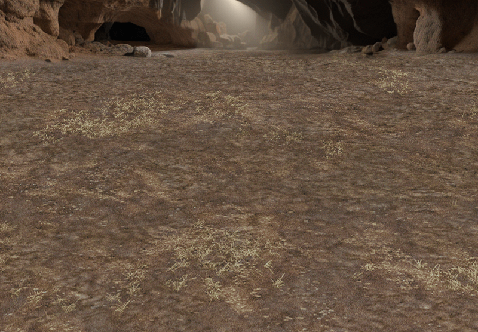

# H3Landscape
Plugin for the [HoMM3 HD+](https://sites.google.com/site/heroes3hd/) (Heroes of Might & Magic III patch)

Compatible with HoMM3 Complete edition, [Horn of the Abyss](https://h3hota.com/en/documentation) 1.8.0 and [ERA 3](https://heroes3wog.net/era-3/)


## About

This add-on makes the battlefield backgrounds better match the terrain on which the battle takes place (it adds a lot of new images of underground battlefields).\
It also adjusts the appearance of certain objects on the adventure map to match the terrain they are located on.\
All the changes that H3Landscape has made to the game are described on the [wiki](https://github.com/Paracelsus83/H3Landscape/wiki).




- [Full list of changes to the game introduced by this addon](CHANGELOG.md)
- [Full list of new battlefield background images](Landscape/img/Readme.md)
- [Full list of new sprites of adventure map objects](Landscape/sprites/adv_obj/Readme.md)

## Download and installation

You can download the H3Landscape plugin installer from the [Last release](https://github.com/Paracelsus83/H3Landscape/releases/latest). \
The installer `H3Landscape.msi` should automatically find the location of the installed “Heroes of Might & Magic III” game. If it does not, you have to specify the folder where the game is located.\
After installing the plugin, run `HD_Launcher.exe` and add “Landscape” to the list of plugins. \
To run Horn of the Abyss with the H3Landscape add-on, use the `H3HotA_HD_L.exe` file.

## Build
To build the H3Landscape plugin, you need Microsoft Visual Studio 2022 or 2026 with the following components installed:
| Component                                       | VS 2022   | VS 2026  |
| :---                                            | :---      | :---     |
| MSBuild                                         | required  | required |
| Windows Universal CRT SDK                       | required  | required |
| MSVC ver 141                                    | required  | optional |
| C++ Windows XP Support for VS 2017 (v141) tools | required  | N/A      |
| MSBuild support for LLVM (clang-cl) toolset     | optional  | required |
| C++ Clang compiler for Windows                  | optional  | required |

For VS 2026, you have to install Windows SDK version 7.1 separately. To do this, download the [ISO image](https://www.microsoft.com/en-us/download/details.aspx?id=8442) from the Microsoft website, and then install the following components:
- `Setup\WinSDKBuild\WinSDKBuild_x86.msi` (headers and libraries),
- `Setup\WinSDKWin32Tools\WinSDKWin32Tools_x86.msi` (tools).

The plugin and patcher for HotA can be compiled in several ways:
- by opening the [`H3Landscape.slnf`](H3Landscape.slnf) solution in Visual Studio 2026 (MSBuild + Clang-CL compiler)
- by using the `CMake` tool with `NMake Makefiles` generator (NMake + Clang-CL compiler)
- by using the `CMake` tool with `Visual Studio` generator (MSBuild + CL compiler)

You can build the MSI installer for H3Landscape in Visual Studio 2026 by opening the full solution `H3Landscape.slnx`.

If you want to build the plugin using CMake on Windows, it is recommended to install the Clang compiler, which is provided as a component of Visual Studio.

To generate project files using CMake, it is best to use the following command:
```
cmake -G "NMake Makefiles" <source dir>
```
(the `NMake` tool is part of the Microsoft Visual Studio package)

To build the `Landscape.lod` resource file, you need the [mmarch.exe](https://github.com/might-and-magic/mmarch/releases/tag/v3.2) tool.
If Visual Studio cannot find this tool during the build process, it will attempt to download it automatically.

H3Landscape uses the [NH3API library](https://github.com/void2012/NH3API), which is included in this project as a git submodule. \
To download the NH3API submodule, after cloning the H3Landscape repository, you have to also execute the command:
```
git submodule update --init
```
